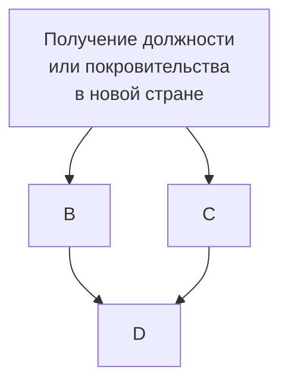

Имя
===
**Джордано "Ноланец" Бруно**

(при рождении _Филиппо Бруно_)

.jpg)

# Год и место рождения

1548 год, Нола, Неаполитанское королество

# Образование

* 1559 - 1565: изучение **логики, литературы и диалектики** в ходе частных занятий в августинском монастыре в Неаполе и посещения публичных лекций в _studium generale_ при монастыре
* 1565 - 1572: изучение __теологии, метафизики м мнемоники__ во время *новициата* (послушничества) при монастыре Сан-Доменико-Мадджоре в Неаполе вплоть до рукоположения в сан священнослужителя Доминиканского ордена в 1572 году и принятия имени Джордано.

<h1><s>История скитаний</s> Профессиональная биография</h1>

## Краткое описание

enum country = { Switerland,France,England, Germany, Czecj};

for(сщг){

    1. Получение должности лектора в университете || Получение покровительства 
    2. Активная преподавательнская деятельность
    3. 
}

<b>Расширенное описание</b>

Страна | Годы | Род занятий
---|---|---
cell1 | cell2 | cell3
cell1 | cell2 | cell3
cell1 | cell2 | cell3

Взгляды
===
